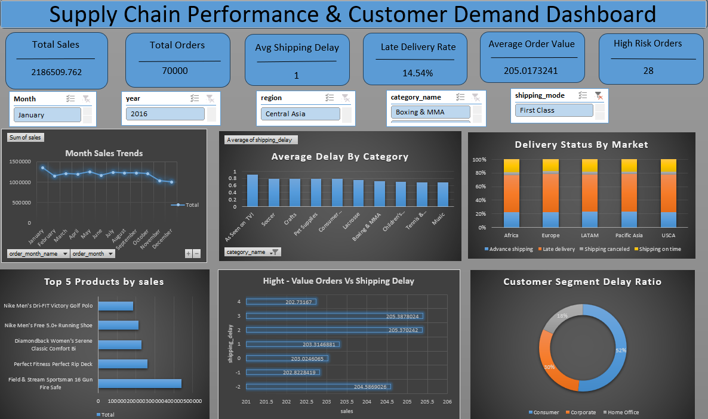
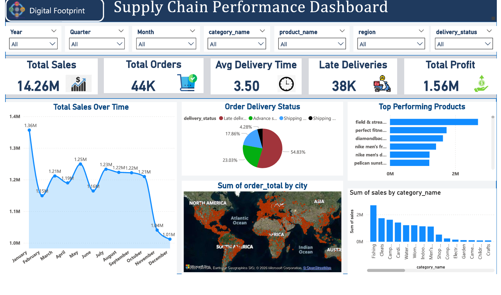
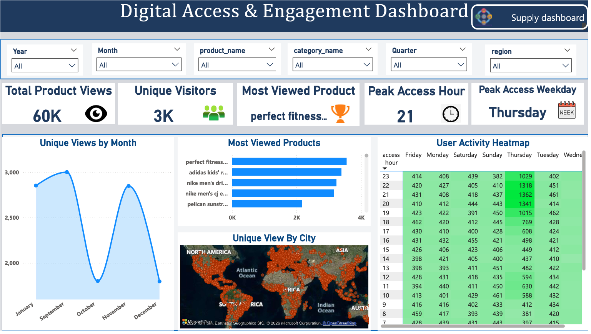
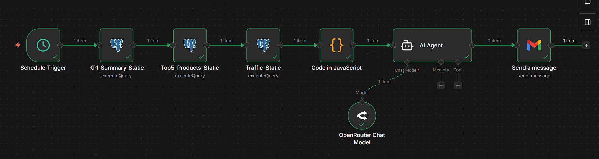
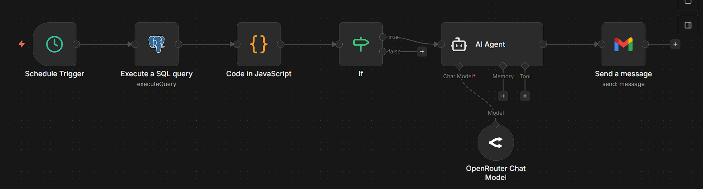

# Data Analyst Project (Week 2 and Week 3)

This README documents only Week 2 and Week 3 deliverables from `DA_final_doc.docx`.

## Week 2

### Unraveling the Narrative of Supply Chain Excellence and Digital Footprints

**Focus:** SQL ETL, Excel EDA, and advanced analytics.

### Week 2 Objectives

- Build analysis-ready daily metrics from supply-chain and access-log data.
- Measure commercial performance and delivery risk trends.
- Create Excel-based analytical outputs and dashboard views.

### Datasets Used

- Source datasets (as listed in final doc):
- `DataCoSupplyChainDataset.csv`
- `TokenizedAccessLogs.csv`
- Cleaned/processed files in this repo:
- [dw_supply_chain_clean.csv](Daraset/dw_supply_chain_clean.csv)
- [dw_access_logs_clean.csv](Daraset/dw_access_logs_clean.csv)

### SQL Analytics Implemented

Using [n8n_workflow_querries.sql](n8n%20workflow/n8n_workflow_querries.sql), Week 2 analysis covers:

- Daily KPI summary using dynamic reporting date logic (`MAX(order_date) - 1 day`).
- Day-over-day comparison against `MAX(order_date) - 2 day`.
- Top 5 products by sales (daily).
- Website traffic summary from access logs.

### Key Metrics Generated

- `total_sales`
- `total_profit`
- `profit_margin_pct`
- `late_delivery_pct`
- `high_risk_orders`
- `late_orders_change_pct`
- `total_views`
- `unique_visitors` (query output)

### Week 2 Deliverables

- SQL query file: [n8n_workflow_querries.sql](n8n%20workflow/n8n_workflow_querries.sql)
- Excel analysis file: [Excel20Question_with_inshits_final.xlsx](Excel20Question_with_inshits_final.xlsx)
- Excel dashboard file: [DAProjectExcel_UsingSQL_dashboard (1).xlsx](DAProjectExcel_UsingSQL_dashboard%20(1).xlsx)

### Week 2 Screenshot

## Week 3

### Power BI Dashboarding, GenAI, and n8n Automation

### Week 3 Objectives

- Convert KPI outputs into BI dashboard visuals.
- Automate daily business summary generation.
- Trigger and send supply-chain risk alerts when thresholds are crossed.

### Power BI Deliverable

- Dashboard file: [DA_e-comerce_dashboard.pbix](DA_e-comerce_dashboard.pbix)

### n8n Workflow 1: Daily AI Business Summary

- Workflow file: [e-commerce_daily_summary_workflow.json](n8n%20workflow/e-commerce_daily_summary_workflow.json)
- Schedule: daily at 9 AM (workflow trigger setting).
- Main nodes:
- `Schedule Trigger`
- `KPI_Summary_Static` (Postgres)
- `Top5_Products_Static` (Postgres)
- `Traffic_Static` (Postgres)
- `Code in JavaScript` (merges query outputs)
- `AI Agent` + `OpenRouter Chat Model`
- `Send a message` (Gmail)
- Prompt constraints:
- summary max 140 words
- highlight risks
- provide 3 actions
- flag operational risk if `late_delivery_pct > 15`
- mention trend if `late_orders_change_pct > 10`

### n8n Workflow 2: Supply Chain Risk Alert

- Workflow file: [Supply_Chain_Risk_Alert_Static.json](n8n%20workflow/Supply_Chain_Risk_Alert_Static.json)
- Schedule: every 2 hours.
- Main nodes:
- `Schedule Trigger`
- `Execute a SQL query` (risk headline metrics)
- `Code in JavaScript` (safe numeric conversion)
- `If` (OR-based risk trigger)
- `AI Agent` + `OpenRouter Chat Model`
- `Send a message` (Gmail)
- IF conditions (OR logic):
- `late_orders_today > late_orders_prev`
- `avg_shipping_delay_today > 0`
- `same_day_late_today > 0`
- AI output constraint: alert message under 120 words with causes and 3 immediate actions.

### Week 3 Screenshots

Power BI:

n8n:

## Tools and Stack Used in Week 2 and Week 3

- PostgreSQL (querying and KPI extraction)
- Excel (EDA and dashboarding)
- Power BI (visual dashboard)
- n8n (automation orchestration)
- OpenRouter LLM integration via n8n AI Agent
- Gmail node for automated notifications
